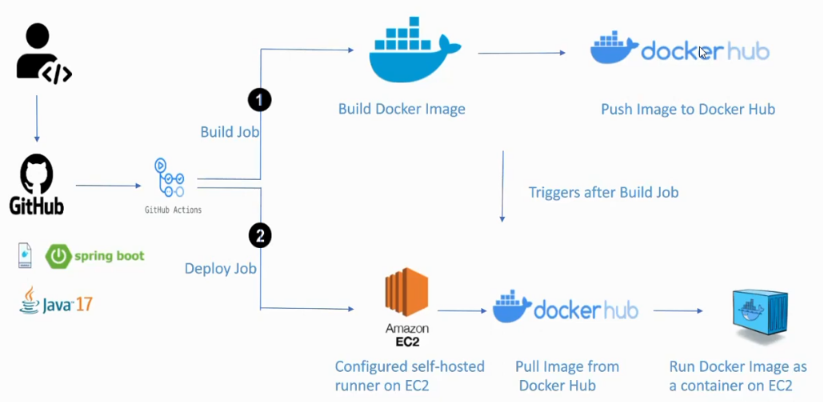

## Overview

This project is a demo application built with Spring Boot. It demonstrates how to create a simple RESTful web service and deploy it to an EC2 instance.



## Getting Started

1. **Clone the repository:**
    ```sh
    git clone https://github.com/yourusername/springboot-demo.git
    cd springboot-demo
    ```

2. **Build the project:**
    ```sh
    mvn clean install
    ```

3. **Run the application:**
    ```sh
    mvn spring-boot:run
    ```

## API Endpoints

- `GET /api/hello` - Returns a greeting message.

## Deploying to EC2

1. **Package the application:**
    ```sh
    mvn package
    ```

2. **Transfer the JAR file to your EC2 instance:**
    ```sh
    scp target/springboot-demo-0.0.1-SNAPSHOT.jar ec2-user@your-ec2-instance.amazonaws.com:~
    ```

3. **SSH into your EC2 instance and run the application:**
    ```sh
    ssh ec2-user@your-ec2-instance.amazonaws.com
    java -jar springboot-demo-0.0.1-SNAPSHOT.jar
    ```
